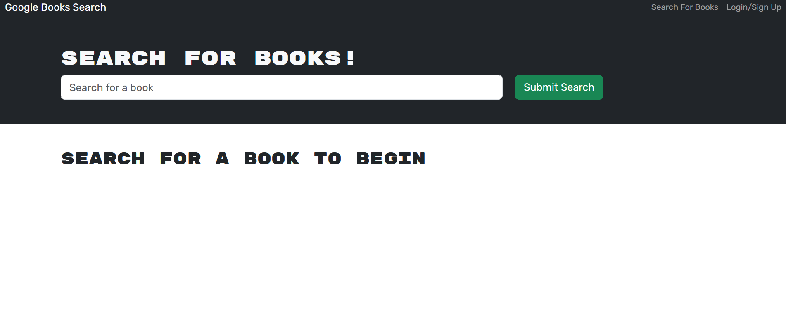

# Book Search

## Table of Contents:

- [Description](#description)
- [User Story](#UserStory)

## Description:

A book search website that allows you to search for books.

[Deployment (Might not work :(](https://booksearchienx-ed92c0638279.herokuapp.com/)

[Book Search GitHub](https://github.com/Ienxternal/BookSearch)

## User Story:

AS AN avid reader
I WANT to search for new books to read
SO THAT I can keep a list of books to purchase

